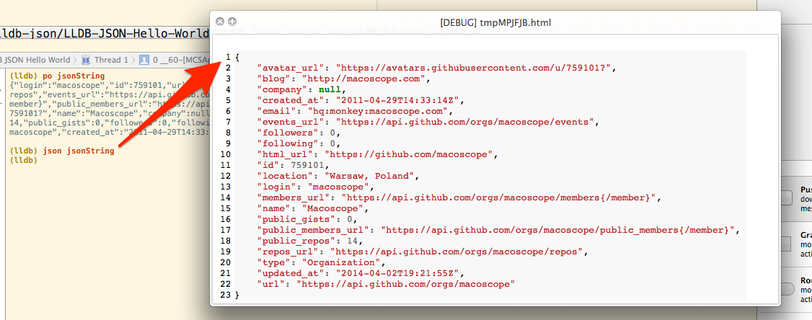

MCSLLDBToolkit
==============

Set of handy LLDB commands that will dramatically improve your debugging workflow

Commands
--------

### `json`

View formatted and colored JSON string in Quick Look.

